# Data Model

SQLite 3 (SQLCipher). All identifiers `snake_case`. Every table has `id INTEGER PRIMARY KEY`.

---

## 1. Storage conventions

| Concept | Storage | Rule |
|---|---|---|
| Money | `INTEGER`, scaled ×10 000 | `12345678` = 1 234.5678 currency units. Never `REAL`. |
| Quantity | `INTEGER`, scaled ×10 000 | Always in the product's **base unit**. |
| Percentage / tax rate | `INTEGER`, scaled ×10 000 | `1500` = 15.00% (i.e. 0.1500) |
| Conversion factor | `INTEGER`, scaled ×10 000 | `1 box = 100 pcs` → `1000000` |
| Timestamp | `TEXT` ISO-8601 with offset | `2026-09-03T14:22:31.123+05:30`. Sortable, unambiguous (DM-06). |
| Date (business day) | `TEXT` `YYYY-MM-DD` | Used for rollups and report grouping |
| Boolean | `INTEGER` 0/1 | |
| Enum | `TEXT` | Uppercase snake, constrained by `CHECK`. Readable in a raw dump — matters for handover. |
| JSON | `TEXT` | Audit before/after, held-bill payload, variant attributes |

Constants in code: `MoneyScale = 10_000`, `QtyScale = 10_000`, `RateScale = 10_000`.

---

## 2. Subject areas

The schema splits into six areas. Diagrams below are per area; a table appears in the area that owns it.

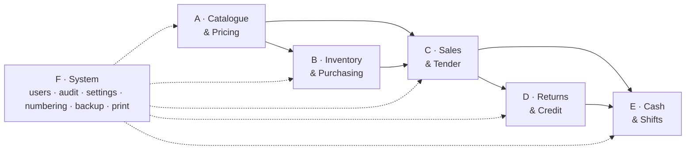

---

## 3. Area A — Catalogue and pricing

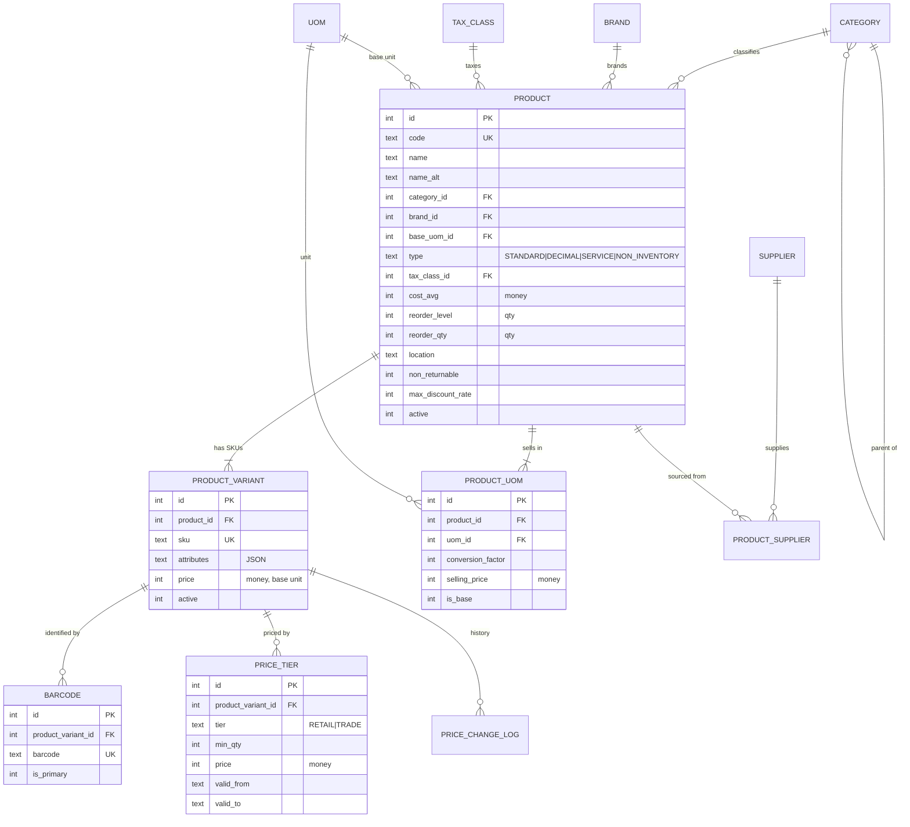

### DDL

```sql
CREATE TABLE category (
  id        INTEGER PRIMARY KEY,
  name      TEXT NOT NULL,
  parent_id INTEGER REFERENCES category(id),
  active    INTEGER NOT NULL DEFAULT 1,
  UNIQUE (name, parent_id)
);
-- FR-2.20: two levels only. Enforced by trigger: a category whose
-- parent_id is not null may not itself be a parent.

CREATE TABLE brand (
  id     INTEGER PRIMARY KEY,
  name   TEXT NOT NULL UNIQUE,
  active INTEGER NOT NULL DEFAULT 1
);

CREATE TABLE tax_class (
  id       INTEGER PRIMARY KEY,
  name     TEXT NOT NULL UNIQUE,          -- 'Standard 15%', 'Zero rated'
  rate     INTEGER NOT NULL,              -- scaled x10000; 1500 = 15%
  active   INTEGER NOT NULL DEFAULT 1
);
-- Tax-inclusive vs exclusive is a shop-wide setting (FR-10.3), not per class.

CREATE TABLE uom (
  id             INTEGER PRIMARY KEY,
  name           TEXT NOT NULL UNIQUE,    -- 'Metre', 'Piece', 'Coil'
  symbol         TEXT NOT NULL,           -- 'm', 'pc', 'coil'
  decimal_places INTEGER NOT NULL DEFAULT 0 CHECK (decimal_places BETWEEN 0 AND 4)
);

CREATE TABLE product (
  id                INTEGER PRIMARY KEY,
  code              TEXT NOT NULL UNIQUE,
  name              TEXT NOT NULL,
  name_alt          TEXT,
  category_id       INTEGER REFERENCES category(id),
  brand_id          INTEGER REFERENCES brand(id),
  base_uom_id       INTEGER NOT NULL REFERENCES uom(id),
  type              TEXT NOT NULL CHECK (type IN
                      ('STANDARD','DECIMAL','SERVICE','NON_INVENTORY')),
  tax_class_id      INTEGER NOT NULL REFERENCES tax_class(id),
  cost_avg          INTEGER NOT NULL DEFAULT 0,   -- moving average, base unit
  reorder_level     INTEGER NOT NULL DEFAULT 0,
  reorder_qty       INTEGER NOT NULL DEFAULT 0,
  location          TEXT,                          -- rack / bin
  non_returnable    INTEGER NOT NULL DEFAULT 0,    -- FR-5, AC-05
  min_sell_qty      INTEGER NOT NULL DEFAULT 0,
  max_discount_rate INTEGER,                       -- null = use global limit
  warranty_days     INTEGER,
  notes             TEXT,
  image_path        TEXT,
  active            INTEGER NOT NULL DEFAULT 1,
  created_at        TEXT NOT NULL,
  updated_at        TEXT NOT NULL
);
CREATE INDEX ix_product_category ON product(category_id);
CREATE INDEX ix_product_brand    ON product(brand_id);
CREATE INDEX ix_product_active   ON product(active);

-- Every product has at least one variant, even if it has no attributes.
-- Uniform handling everywhere downstream: stock, sales and returns always
-- reference a variant, never a product. This is worth the one extra row.
CREATE TABLE product_variant (
  id         INTEGER PRIMARY KEY,
  product_id INTEGER NOT NULL REFERENCES product(id),
  sku        TEXT NOT NULL UNIQUE,
  attributes TEXT NOT NULL DEFAULT '{}',   -- {"size":"M8","length":"50mm",...}
  price      INTEGER NOT NULL,             -- money, per BASE unit, retail
  active     INTEGER NOT NULL DEFAULT 1,
  created_at TEXT NOT NULL
);
CREATE INDEX ix_variant_product ON product_variant(product_id);

CREATE TABLE product_uom (
  id                INTEGER PRIMARY KEY,
  product_id        INTEGER NOT NULL REFERENCES product(id),
  uom_id            INTEGER NOT NULL REFERENCES uom(id),
  conversion_factor INTEGER NOT NULL CHECK (conversion_factor > 0),
  selling_price     INTEGER,      -- null = base price x factor (FR-2.5)
  is_base           INTEGER NOT NULL DEFAULT 0,
  UNIQUE (product_id, uom_id)
);
-- Exactly one row per product with is_base = 1 and conversion_factor = 10000.
-- Enforced by trigger.

CREATE TABLE barcode (
  id                 INTEGER PRIMARY KEY,
  product_variant_id INTEGER NOT NULL REFERENCES product_variant(id),
  barcode            TEXT NOT NULL UNIQUE,
  is_primary         INTEGER NOT NULL DEFAULT 0
);
CREATE INDEX ix_barcode_variant ON barcode(product_variant_id);
-- barcode UNIQUE is the hot path index for NFR-P1.

CREATE TABLE price_tier (
  id                 INTEGER PRIMARY KEY,
  product_variant_id INTEGER NOT NULL REFERENCES product_variant(id),
  tier               TEXT NOT NULL CHECK (tier IN ('RETAIL','TRADE')),
  min_qty            INTEGER NOT NULL DEFAULT 0,
  price              INTEGER NOT NULL,
  valid_from         TEXT,
  valid_to           TEXT
);
CREATE INDEX ix_price_tier_lookup
  ON price_tier(product_variant_id, tier, min_qty);

CREATE TABLE price_change_log (          -- FR-2.17
  id                 INTEGER PRIMARY KEY,
  product_variant_id INTEGER NOT NULL REFERENCES product_variant(id),
  old_price          INTEGER NOT NULL,
  new_price          INTEGER NOT NULL,
  changed_at         TEXT NOT NULL,
  user_id            INTEGER NOT NULL REFERENCES app_user(id),
  reason             TEXT
);

CREATE TABLE product_supplier (
  id          INTEGER PRIMARY KEY,
  product_id  INTEGER NOT NULL REFERENCES product(id),
  supplier_id INTEGER NOT NULL REFERENCES supplier(id),
  supplier_ref TEXT,
  last_cost   INTEGER,
  UNIQUE (product_id, supplier_id)
);
```

### Full-text search (FR-2.11, NFR-P2)

```sql
CREATE VIRTUAL TABLE product_search USING fts5(
  name, name_alt, code, sku, brand, category, location,
  content=''            -- contentless; we store the rowid mapping ourselves
);
-- rowid = product_variant.id
-- Maintained by AFTER INSERT/UPDATE/DELETE triggers on product and
-- product_variant. Rebuildable by ReindexSearchCommand.
```

---

## 4. Area B — Inventory and purchasing

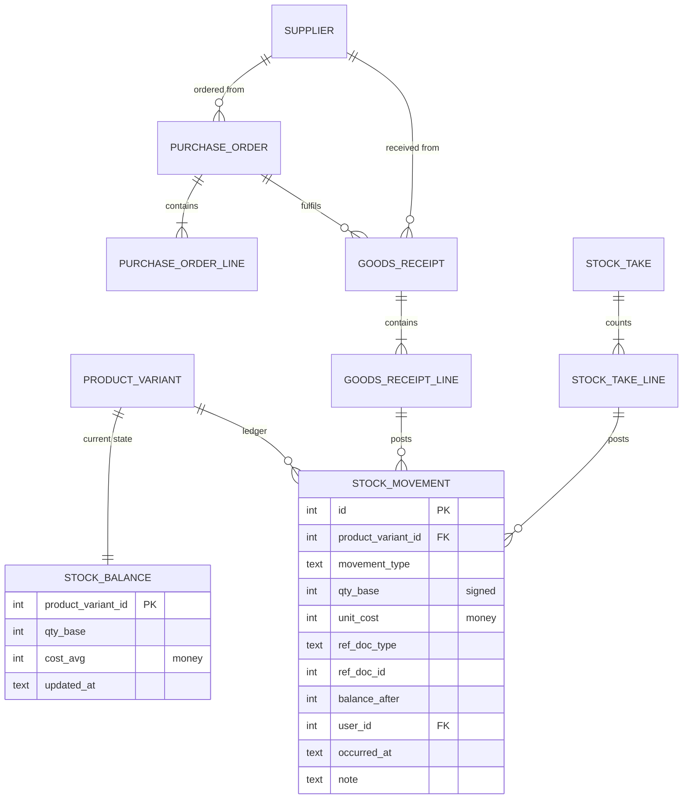

### DDL

```sql
CREATE TABLE supplier (
  id             INTEGER PRIMARY KEY,
  name           TEXT NOT NULL,
  contact        TEXT, phone TEXT, address TEXT, tax_no TEXT,
  payment_terms  TEXT,
  active         INTEGER NOT NULL DEFAULT 1
);

CREATE TABLE stock_balance (
  product_variant_id INTEGER PRIMARY KEY REFERENCES product_variant(id),
  qty_base           INTEGER NOT NULL DEFAULT 0,
  cost_avg           INTEGER NOT NULL DEFAULT 0,
  updated_at         TEXT NOT NULL
);
CREATE INDEX ix_stock_balance_low ON stock_balance(qty_base);

CREATE TABLE stock_movement (            -- APPEND ONLY
  id                 INTEGER PRIMARY KEY,
  product_variant_id INTEGER NOT NULL REFERENCES product_variant(id),
  movement_type      TEXT NOT NULL CHECK (movement_type IN (
                       'GRN','SALE','RETURN_IN','ADJUSTMENT','DAMAGE',
                       'STOCK_TAKE','BULK_BREAK_OUT','BULK_BREAK_IN',
                       'OPENING','TRANSFER_OUT','TRANSFER_IN')),
  qty_base           INTEGER NOT NULL,   -- signed: + increases stock
  unit_cost          INTEGER NOT NULL,   -- money, at the moment of movement
  ref_doc_type       TEXT NOT NULL,      -- 'SALE','GRN','RETURN','STOCK_TAKE',...
  ref_doc_id         INTEGER,
  balance_after      INTEGER NOT NULL,
  user_id            INTEGER NOT NULL REFERENCES app_user(id),
  occurred_at        TEXT NOT NULL,
  note               TEXT
);
CREATE INDEX ix_movement_variant_time
  ON stock_movement(product_variant_id, occurred_at);
CREATE INDEX ix_movement_ref  ON stock_movement(ref_doc_type, ref_doc_id);
CREATE INDEX ix_movement_time ON stock_movement(occurred_at);

CREATE TABLE purchase_order (
  id            INTEGER PRIMARY KEY,
  po_no         TEXT NOT NULL UNIQUE,
  supplier_id   INTEGER NOT NULL REFERENCES supplier(id),
  ordered_at    TEXT NOT NULL,
  expected_at   TEXT,
  status        TEXT NOT NULL CHECK (status IN
                  ('DRAFT','SENT','PARTIAL','RECEIVED','CANCELLED')),
  user_id       INTEGER NOT NULL REFERENCES app_user(id),
  note          TEXT
);

CREATE TABLE purchase_order_line (
  id                 INTEGER PRIMARY KEY,
  purchase_order_id  INTEGER NOT NULL REFERENCES purchase_order(id),
  product_variant_id INTEGER NOT NULL REFERENCES product_variant(id),
  qty                INTEGER NOT NULL,      -- in uom_id, not base
  uom_id             INTEGER NOT NULL REFERENCES uom(id),
  unit_cost          INTEGER NOT NULL,
  qty_received_base  INTEGER NOT NULL DEFAULT 0
);

CREATE TABLE goods_receipt (
  id               INTEGER PRIMARY KEY,
  grn_no           TEXT NOT NULL UNIQUE,
  supplier_id      INTEGER NOT NULL REFERENCES supplier(id),
  purchase_order_id INTEGER REFERENCES purchase_order(id),
  supplier_inv_no  TEXT,
  received_at      TEXT NOT NULL,
  subtotal         INTEGER NOT NULL,
  tax              INTEGER NOT NULL DEFAULT 0,
  other_cost       INTEGER NOT NULL DEFAULT 0,   -- freight etc, apportioned
  total            INTEGER NOT NULL,
  user_id          INTEGER NOT NULL REFERENCES app_user(id),
  note             TEXT
);

CREATE TABLE goods_receipt_line (
  id                 INTEGER PRIMARY KEY,
  goods_receipt_id   INTEGER NOT NULL REFERENCES goods_receipt(id),
  product_variant_id INTEGER NOT NULL REFERENCES product_variant(id),
  qty                INTEGER NOT NULL,         -- as entered, in uom_id
  uom_id             INTEGER NOT NULL REFERENCES uom(id),
  qty_base           INTEGER NOT NULL,         -- converted (AC-08)
  unit_cost          INTEGER NOT NULL,         -- per uom_id
  unit_cost_base     INTEGER NOT NULL,         -- per base unit
  tax                INTEGER NOT NULL DEFAULT 0,
  line_total         INTEGER NOT NULL
);
CREATE INDEX ix_grn_line_grn ON goods_receipt_line(goods_receipt_id);

CREATE TABLE stock_take (
  id           INTEGER PRIMARY KEY,
  scope        TEXT NOT NULL,        -- 'ALL' | 'CATEGORY:12' | 'LOCATION:A3'
  started_at   TEXT NOT NULL,
  completed_at TEXT,
  status       TEXT NOT NULL CHECK (status IN ('OPEN','POSTED','ABANDONED')),
  user_id      INTEGER NOT NULL REFERENCES app_user(id)
);

CREATE TABLE stock_take_line (
  id                 INTEGER PRIMARY KEY,
  stock_take_id      INTEGER NOT NULL REFERENCES stock_take(id),
  product_variant_id INTEGER NOT NULL REFERENCES product_variant(id),
  system_qty         INTEGER NOT NULL,   -- frozen when the sheet is generated
  counted_qty        INTEGER,
  variance           INTEGER,
  counted_at         TEXT
);
CREATE INDEX ix_stock_take_line_take ON stock_take_line(stock_take_id);
```

---

## 5. Area C — Sales and tender

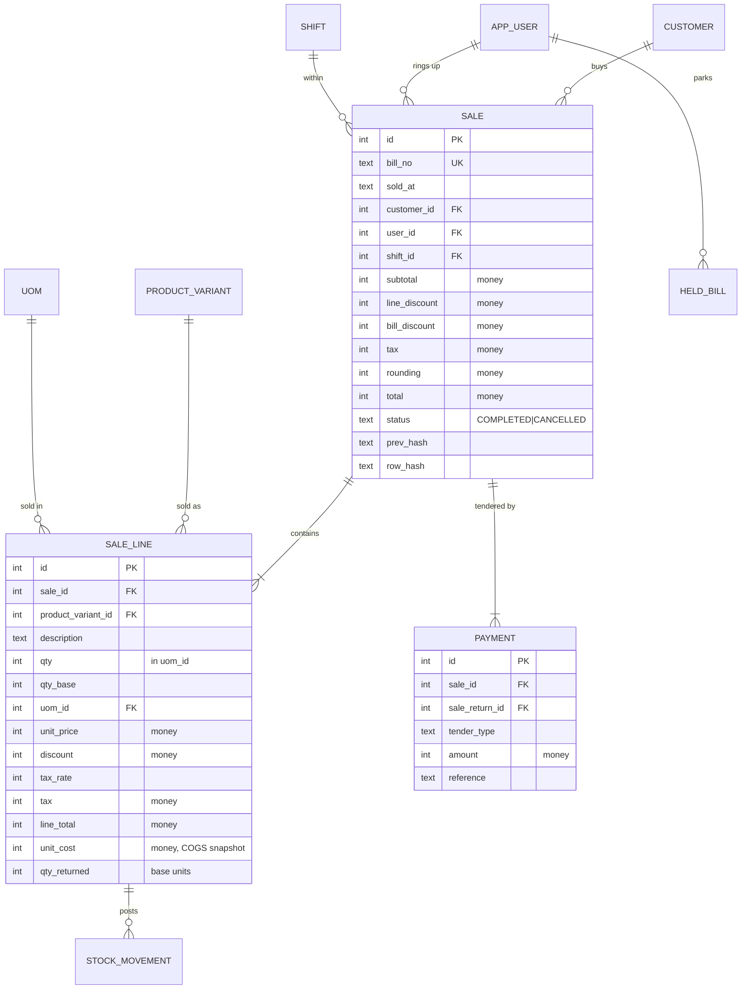

### DDL

```sql
CREATE TABLE customer (
  id           INTEGER PRIMARY KEY,
  name         TEXT NOT NULL,
  phone        TEXT, address TEXT, tax_no TEXT,
  type         TEXT NOT NULL DEFAULT 'RETAIL' CHECK (type IN ('RETAIL','TRADE')),
  credit_limit INTEGER NOT NULL DEFAULT 0,
  balance      INTEGER NOT NULL DEFAULT 0,
  active       INTEGER NOT NULL DEFAULT 1,
  created_at   TEXT NOT NULL
);
CREATE INDEX ix_customer_phone ON customer(phone);

CREATE TABLE sale (                       -- APPEND ONLY (status is the exception)
  id            INTEGER PRIMARY KEY,
  bill_no       TEXT NOT NULL UNIQUE,
  sold_at       TEXT NOT NULL,
  business_date TEXT NOT NULL,            -- YYYY-MM-DD, for rollups
  customer_id   INTEGER REFERENCES customer(id),
  user_id       INTEGER NOT NULL REFERENCES app_user(id),
  shift_id      INTEGER NOT NULL REFERENCES shift(id),
  subtotal      INTEGER NOT NULL,
  line_discount INTEGER NOT NULL DEFAULT 0,
  bill_discount INTEGER NOT NULL DEFAULT 0,
  tax           INTEGER NOT NULL DEFAULT 0,
  rounding      INTEGER NOT NULL DEFAULT 0,
  total         INTEGER NOT NULL,
  cogs          INTEGER NOT NULL DEFAULT 0,
  status        TEXT NOT NULL CHECK (status IN ('COMPLETED','CANCELLED')),
  cancelled_by  INTEGER REFERENCES app_user(id),
  cancelled_at  TEXT,
  note          TEXT,
  prev_hash     TEXT NOT NULL,
  row_hash      TEXT NOT NULL
);
CREATE INDEX ix_sale_date   ON sale(business_date);
CREATE INDEX ix_sale_shift  ON sale(shift_id);
CREATE INDEX ix_sale_cust   ON sale(customer_id);
CREATE INDEX ix_sale_soldat ON sale(sold_at);

CREATE TABLE sale_line (                  -- APPEND ONLY (qty_returned is the exception)
  id                 INTEGER PRIMARY KEY,
  sale_id            INTEGER NOT NULL REFERENCES sale(id),
  line_no            INTEGER NOT NULL,
  product_variant_id INTEGER REFERENCES product_variant(id),  -- null for open item
  description        TEXT NOT NULL,       -- snapshot: the name as sold
  qty                INTEGER NOT NULL,
  uom_id             INTEGER NOT NULL REFERENCES uom(id),
  qty_base           INTEGER NOT NULL,
  unit_price         INTEGER NOT NULL,    -- per uom_id, as charged
  discount           INTEGER NOT NULL DEFAULT 0,
  tax_rate           INTEGER NOT NULL DEFAULT 0,
  tax                INTEGER NOT NULL DEFAULT 0,
  line_total         INTEGER NOT NULL,
  unit_cost          INTEGER NOT NULL DEFAULT 0,   -- COGS snapshot, base unit
  qty_returned       INTEGER NOT NULL DEFAULT 0,   -- base units (AC-06)
  note               TEXT,
  UNIQUE (sale_id, line_no)
);
CREATE INDEX ix_sale_line_sale    ON sale_line(sale_id);
CREATE INDEX ix_sale_line_variant ON sale_line(product_variant_id, sale_id);

CREATE TABLE payment (                    -- APPEND ONLY
  id             INTEGER PRIMARY KEY,
  sale_id        INTEGER REFERENCES sale(id),
  sale_return_id INTEGER REFERENCES sale_return(id),
  tender_type    TEXT NOT NULL CHECK (tender_type IN
                   ('CASH','CARD','BANK_TRANSFER','CREDIT_NOTE','ON_ACCOUNT','CHEQUE')),
  amount         INTEGER NOT NULL,        -- negative for a refund out
  reference      TEXT,                    -- max 20 chars, PAN-rejecting (NFR-S7)
  paid_at        TEXT NOT NULL,
  CHECK ((sale_id IS NOT NULL) <> (sale_return_id IS NOT NULL))
);
CREATE INDEX ix_payment_sale   ON payment(sale_id);
CREATE INDEX ix_payment_return ON payment(sale_return_id);

CREATE TABLE held_bill (
  id         INTEGER PRIMARY KEY,
  label      TEXT NOT NULL,
  payload    TEXT NOT NULL,               -- JSON snapshot of the in-progress bill
  created_at TEXT NOT NULL,
  user_id    INTEGER NOT NULL REFERENCES app_user(id)
);
```

**Why `sale_line` snapshots `description`, `unit_price` and `unit_cost`:** a return six months later must refund at the price originally paid (AC-03) and profit reports must use the cost at the time of sale. Neither can be recovered from the catalogue, because the catalogue moves.

---

## 6. Area D — Returns and credit

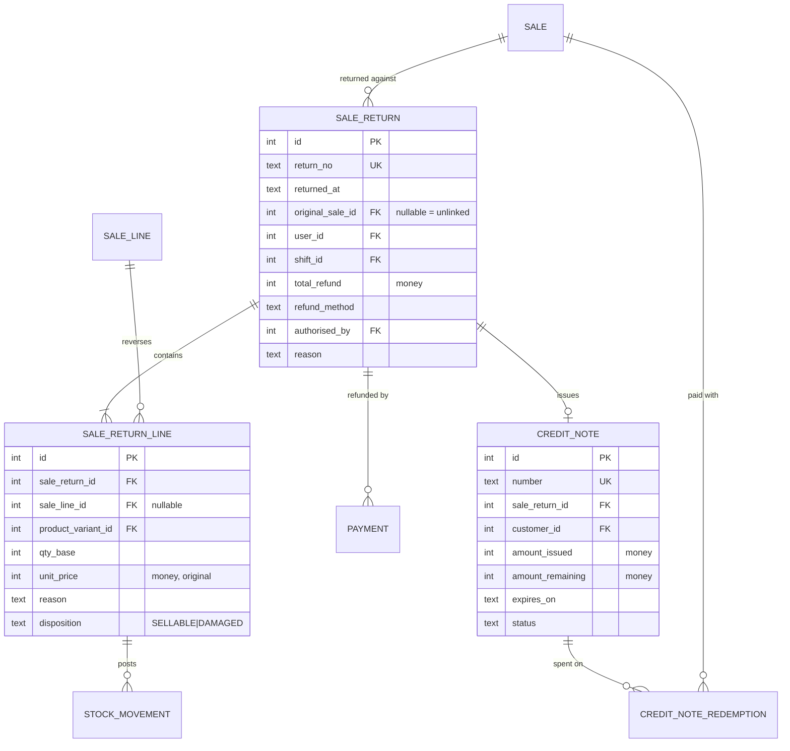

### DDL

```sql
CREATE TABLE sale_return (                -- APPEND ONLY
  id               INTEGER PRIMARY KEY,
  return_no        TEXT NOT NULL UNIQUE,
  returned_at      TEXT NOT NULL,
  business_date    TEXT NOT NULL,
  original_sale_id INTEGER REFERENCES sale(id),   -- NULL = unlinked (FR-5, elevated risk)
  exchange_sale_id INTEGER REFERENCES sale(id),   -- set when part of an exchange
  customer_id      INTEGER REFERENCES customer(id),
  user_id          INTEGER NOT NULL REFERENCES app_user(id),
  shift_id         INTEGER NOT NULL REFERENCES shift(id),
  subtotal         INTEGER NOT NULL,
  tax              INTEGER NOT NULL DEFAULT 0,
  restocking_fee   INTEGER NOT NULL DEFAULT 0,
  total_refund     INTEGER NOT NULL,
  refund_method    TEXT NOT NULL CHECK (refund_method IN
                     ('CASH','CARD','CREDIT_NOTE','EXCHANGE','ON_ACCOUNT')),
  authorised_by    INTEGER REFERENCES app_user(id),   -- owner, for overrides
  reason           TEXT,
  prev_hash        TEXT NOT NULL,
  row_hash         TEXT NOT NULL
);
CREATE INDEX ix_return_date ON sale_return(business_date);
CREATE INDEX ix_return_sale ON sale_return(original_sale_id);

CREATE TABLE sale_return_line (           -- APPEND ONLY
  id                 INTEGER PRIMARY KEY,
  sale_return_id     INTEGER NOT NULL REFERENCES sale_return(id),
  sale_line_id       INTEGER REFERENCES sale_line(id),   -- NULL when unlinked
  product_variant_id INTEGER NOT NULL REFERENCES product_variant(id),
  qty_base           INTEGER NOT NULL CHECK (qty_base > 0),
  unit_price         INTEGER NOT NULL,   -- the price ORIGINALLY paid (AC-03)
  unit_cost          INTEGER NOT NULL,
  tax                INTEGER NOT NULL DEFAULT 0,
  line_refund        INTEGER NOT NULL,
  reason             TEXT NOT NULL,
  disposition        TEXT NOT NULL CHECK (disposition IN ('SELLABLE','DAMAGED'))
);

CREATE TABLE credit_note (
  id               INTEGER PRIMARY KEY,
  number           TEXT NOT NULL UNIQUE,
  sale_return_id   INTEGER NOT NULL REFERENCES sale_return(id),
  customer_id      INTEGER REFERENCES customer(id),
  amount_issued    INTEGER NOT NULL,
  amount_remaining INTEGER NOT NULL,
  issued_at        TEXT NOT NULL,
  expires_on       TEXT,
  status           TEXT NOT NULL CHECK (status IN ('ACTIVE','SPENT','EXPIRED','VOID'))
);

CREATE TABLE credit_note_redemption (
  id             INTEGER PRIMARY KEY,
  credit_note_id INTEGER NOT NULL REFERENCES credit_note(id),
  sale_id        INTEGER NOT NULL REFERENCES sale(id),
  amount         INTEGER NOT NULL,
  redeemed_at    TEXT NOT NULL
);
```

**AC-06 (no cumulative over-return)** is enforced inside the return transaction:
`sale_line.qty_returned + requested_qty_base <= sale_line.qty_base`, checked with the row locked by the write transaction, then incremented. It is the one permitted `UPDATE` on `sale_line`.

---

## 7. Area E — Cash and shifts

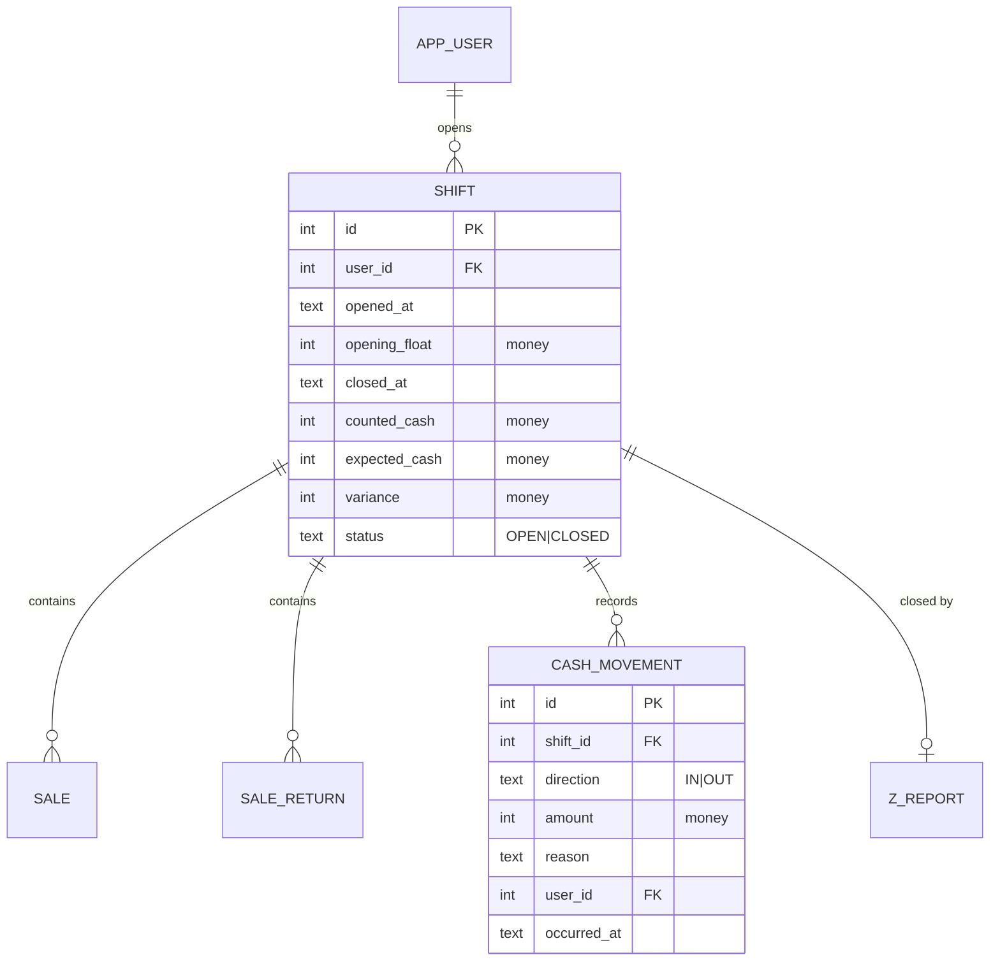

```sql
CREATE TABLE shift (                      -- APPEND ONLY (close fields settable once)
  id             INTEGER PRIMARY KEY,
  shift_no       TEXT NOT NULL UNIQUE,
  user_id        INTEGER NOT NULL REFERENCES app_user(id),
  opened_at      TEXT NOT NULL,
  business_date  TEXT NOT NULL,
  opening_float  INTEGER NOT NULL,
  closed_at      TEXT,
  counted_cash   INTEGER,
  expected_cash  INTEGER,
  variance       INTEGER,
  status         TEXT NOT NULL CHECK (status IN ('OPEN','CLOSED')),
  closed_by      INTEGER REFERENCES app_user(id),
  note           TEXT
);
CREATE UNIQUE INDEX ux_one_open_shift ON shift(status) WHERE status = 'OPEN';
-- C-01: at most one open shift, enforced by the database.

CREATE TABLE cash_movement (              -- APPEND ONLY
  id          INTEGER PRIMARY KEY,
  shift_id    INTEGER NOT NULL REFERENCES shift(id),
  direction   TEXT NOT NULL CHECK (direction IN ('IN','OUT')),
  amount      INTEGER NOT NULL CHECK (amount > 0),
  reason      TEXT NOT NULL,
  user_id     INTEGER NOT NULL REFERENCES app_user(id),
  occurred_at TEXT NOT NULL
);

-- Rollups, written in the same transaction as the Z report (NFR-P5)
CREATE TABLE daily_sales_summary (
  business_date TEXT PRIMARY KEY,
  bill_count    INTEGER NOT NULL,
  gross         INTEGER NOT NULL,
  discount      INTEGER NOT NULL,
  tax           INTEGER NOT NULL,
  net           INTEGER NOT NULL,
  cogs          INTEGER NOT NULL,
  return_count  INTEGER NOT NULL,
  return_value  INTEGER NOT NULL,
  tender_cash   INTEGER NOT NULL,
  tender_card   INTEGER NOT NULL,
  tender_other  INTEGER NOT NULL,
  built_at      TEXT NOT NULL
);

CREATE TABLE daily_product_summary (
  business_date      TEXT NOT NULL,
  product_variant_id INTEGER NOT NULL REFERENCES product_variant(id),
  qty_base           INTEGER NOT NULL,
  net                INTEGER NOT NULL,
  cogs               INTEGER NOT NULL,
  PRIMARY KEY (business_date, product_variant_id)
);
```

---

## 8. Area F — System

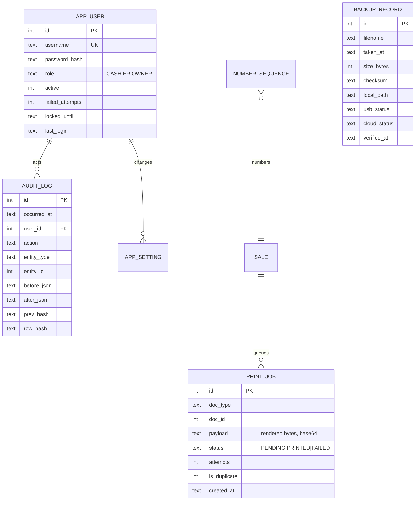

```sql
CREATE TABLE app_user (
  id              INTEGER PRIMARY KEY,
  username        TEXT NOT NULL UNIQUE,
  display_name    TEXT NOT NULL,
  password_hash   TEXT NOT NULL,          -- Argon2id encoded string
  role            TEXT NOT NULL CHECK (role IN ('CASHIER','OWNER')),
  active          INTEGER NOT NULL DEFAULT 1,
  failed_attempts INTEGER NOT NULL DEFAULT 0,
  locked_until    TEXT,
  last_login      TEXT,
  created_at      TEXT NOT NULL
);

CREATE TABLE app_setting (
  key        TEXT PRIMARY KEY,
  value      TEXT NOT NULL,
  value_type TEXT NOT NULL CHECK (value_type IN ('STRING','INT','MONEY','BOOL','JSON')),
  updated_by INTEGER REFERENCES app_user(id),
  updated_at TEXT NOT NULL
);

CREATE TABLE number_sequence (
  doc_type TEXT PRIMARY KEY CHECK (doc_type IN
             ('SALE','RETURN','CREDIT_NOTE','GRN','PO','SHIFT','STOCK_TAKE','QUOTE')),
  prefix   TEXT NOT NULL,          -- e.g. 'INV-'
  pattern  TEXT NOT NULL,          -- e.g. '{prefix}{yyyy}-{n:000000}'
  next_val INTEGER NOT NULL
);

CREATE TABLE audit_log (                  -- APPEND ONLY, hash chained
  id          INTEGER PRIMARY KEY,
  occurred_at TEXT NOT NULL,
  user_id     INTEGER REFERENCES app_user(id),
  action      TEXT NOT NULL,              -- 'SALE_CANCELLED','PRICE_CHANGED',...
  entity_type TEXT NOT NULL,
  entity_id   INTEGER,
  before_json TEXT,
  after_json  TEXT,
  reason      TEXT,
  prev_hash   TEXT NOT NULL,
  row_hash    TEXT NOT NULL
);
CREATE INDEX ix_audit_time   ON audit_log(occurred_at);
CREATE INDEX ix_audit_entity ON audit_log(entity_type, entity_id);

CREATE TABLE print_job (
  id           INTEGER PRIMARY KEY,
  doc_type     TEXT NOT NULL CHECK (doc_type IN
                 ('SALE','RETURN','CREDIT_NOTE','X_REPORT','Z_REPORT',
                  'GRN','PO','STOCK_TAKE','LABEL','CASH_SLIP')),
  doc_id       INTEGER,
  target       TEXT NOT NULL DEFAULT 'RECEIPT',   -- RECEIPT|A4|LABEL
  payload      BLOB NOT NULL,                     -- rendered ESC/POS or PDF path
  copies       INTEGER NOT NULL DEFAULT 1,
  is_duplicate INTEGER NOT NULL DEFAULT 0,        -- FR-7.6
  status       TEXT NOT NULL CHECK (status IN ('PENDING','PRINTED','FAILED')),
  attempts     INTEGER NOT NULL DEFAULT 0,
  last_error   TEXT,
  created_at   TEXT NOT NULL,
  printed_at   TEXT
);
CREATE INDEX ix_print_pending ON print_job(status) WHERE status = 'PENDING';

CREATE TABLE backup_record (
  id          INTEGER PRIMARY KEY,
  filename    TEXT NOT NULL,
  taken_at    TEXT NOT NULL,
  size_bytes  INTEGER NOT NULL,
  checksum    TEXT NOT NULL,               -- SHA-256 of ciphertext
  schema_ver  TEXT NOT NULL,
  local_path  TEXT,
  usb_status  TEXT NOT NULL CHECK (usb_status  IN ('NA','OK','FAILED')),
  cloud_status TEXT NOT NULL CHECK (cloud_status IN ('PENDING','OK','FAILED','SKIPPED')),
  cloud_key   TEXT,
  attempts    INTEGER NOT NULL DEFAULT 0,
  last_error  TEXT,
  verified_at TEXT
);

CREATE TABLE schema_version (
  version    TEXT PRIMARY KEY,
  applied_at TEXT NOT NULL
);
```

### Append-only triggers (pattern — repeat per table)

```sql
CREATE TRIGGER trg_stock_movement_no_update
BEFORE UPDATE ON stock_movement
BEGIN SELECT RAISE(ABORT, 'stock_movement is append-only'); END;

CREATE TRIGGER trg_stock_movement_no_delete
BEFORE DELETE ON stock_movement
BEGIN SELECT RAISE(ABORT, 'stock_movement is append-only'); END;

-- Column-scoped exception: only qty_returned may change on sale_line
CREATE TRIGGER trg_sale_line_restricted_update
BEFORE UPDATE ON sale_line
WHEN  old.sale_id            <> new.sale_id
   OR old.product_variant_id IS NOT new.product_variant_id
   OR old.qty                <> new.qty
   OR old.qty_base           <> new.qty_base
   OR old.unit_price         <> new.unit_price
   OR old.line_total         <> new.line_total
   OR old.unit_cost          <> new.unit_cost
BEGIN SELECT RAISE(ABORT, 'sale_line: only qty_returned may be updated'); END;

-- Sales may not be posted into a closed shift (FR-8.5, AC-11)
CREATE TRIGGER trg_sale_shift_open
BEFORE INSERT ON sale
WHEN (SELECT status FROM shift WHERE id = new.shift_id) <> 'OPEN'
BEGIN SELECT RAISE(ABORT, 'cannot post into a closed shift'); END;
```

---

## 9. State machines

### Sale

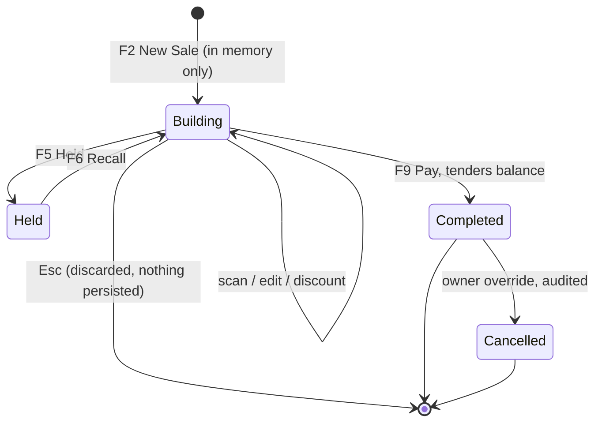

A bill exists in the database only once it is `COMPLETED`. Nothing half-finished is ever persisted, which is why AC-15 (power cut mid-bill) has a trivially correct answer: the in-progress bill is gone, the last committed bill is intact.

### Shift

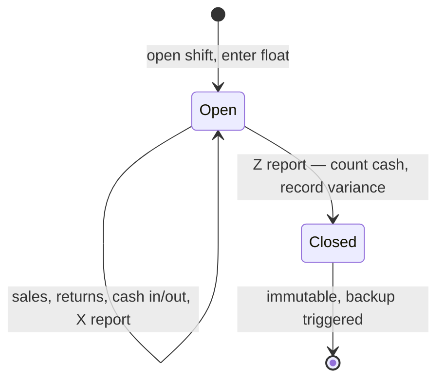

### Print job

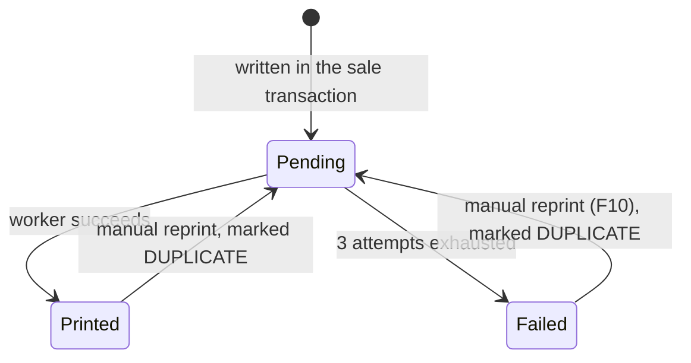

### Backup

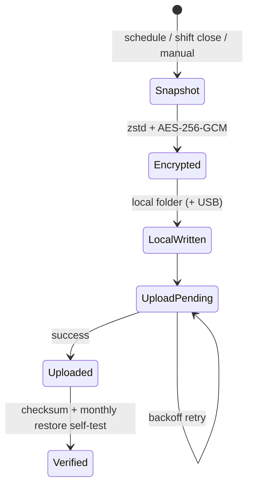

---

## 10. Enumerations (single source of truth)

Mirror these exactly as C# enums in `Domain/Enums/`. The `CHECK` constraints above and the enums must never drift; an integration test asserts every enum member is accepted by its column and every non-member is rejected.

| Enum | Values |
|---|---|
| `Role` | `CASHIER`, `OWNER` |
| `ProductType` | `STANDARD`, `DECIMAL`, `SERVICE`, `NON_INVENTORY` |
| `MovementType` | `GRN`, `SALE`, `RETURN_IN`, `ADJUSTMENT`, `DAMAGE`, `STOCK_TAKE`, `BULK_BREAK_OUT`, `BULK_BREAK_IN`, `OPENING`, `TRANSFER_OUT`, `TRANSFER_IN` |
| `TenderType` | `CASH`, `CARD`, `BANK_TRANSFER`, `CREDIT_NOTE`, `ON_ACCOUNT`, `CHEQUE` |
| `SaleStatus` | `COMPLETED`, `CANCELLED` |
| `RefundMethod` | `CASH`, `CARD`, `CREDIT_NOTE`, `EXCHANGE`, `ON_ACCOUNT` |
| `Disposition` | `SELLABLE`, `DAMAGED` |
| `ShiftStatus` | `OPEN`, `CLOSED` |
| `PriceTierName` | `RETAIL`, `TRADE` |
| `PrintDocType` | `SALE`, `RETURN`, `CREDIT_NOTE`, `X_REPORT`, `Z_REPORT`, `GRN`, `PO`, `STOCK_TAKE`, `LABEL`, `CASH_SLIP` |
| `PrintStatus` | `PENDING`, `PRINTED`, `FAILED` |
| `CloudStatus` | `PENDING`, `OK`, `FAILED`, `SKIPPED` |

---

## 11. Seed data (created by the first-run wizard)

| Table | Rows |
|---|---|
| `uom` | Piece (pc, 0dp), Metre (m, 3dp), Kilogram (kg, 3dp), Litre (L, 3dp), Box, Coil, Packet, Roll, Bundle |
| `tax_class` | From Q-01. Default: `Standard` at the shop's rate, `Zero rated` at 0. |
| `number_sequence` | `SALE` → `INV-{yyyy}-{n:000000}`, `RETURN` → `RTN-…`, `CREDIT_NOTE` → `CN-…`, `GRN` → `GRN-…`, `PO` → `PO-…`, `SHIFT` → `SH-…`, all `next_val = 1` (Q-16) |
| `app_user` | One `OWNER` account created in the wizard. No default password, ever. |
| `app_setting` | Full defaults per FR-10.1–10.8 (see `Application/Settings/SettingDefaults.cs`) |
| `category` | Plumbing, Electrical, Fasteners, Tools, Paint, Adhesives, Garden, Building — editable |

---

## 12. Index rationale

| Index | Serves |
|---|---|
| `barcode.barcode` UNIQUE | NFR-P1 — the single hottest lookup in the system |
| `product_search` FTS5 | NFR-P2 |
| `sale.bill_no` UNIQUE | NFR-P4, return-by-receipt |
| `sale.business_date` | every date-range report |
| `sale_line.sale_id` | bill recall, reprint, return |
| `sale_line(product_variant_id, sale_id)` | product sales history, return lookup by item |
| `stock_movement(product_variant_id, occurred_at)` | stock card / item history |
| `stock_movement(ref_doc_type, ref_doc_id)` | "show me the movements this GRN posted" |
| `stock_balance.qty_base` | low-stock / reorder report |
| `ux_one_open_shift` partial unique | C-01 enforced by the database |
| `print_job.status` partial | outbox polling stays O(pending) |

Run `ANALYZE` after bulk import and `PRAGMA optimize` on clean shutdown.
